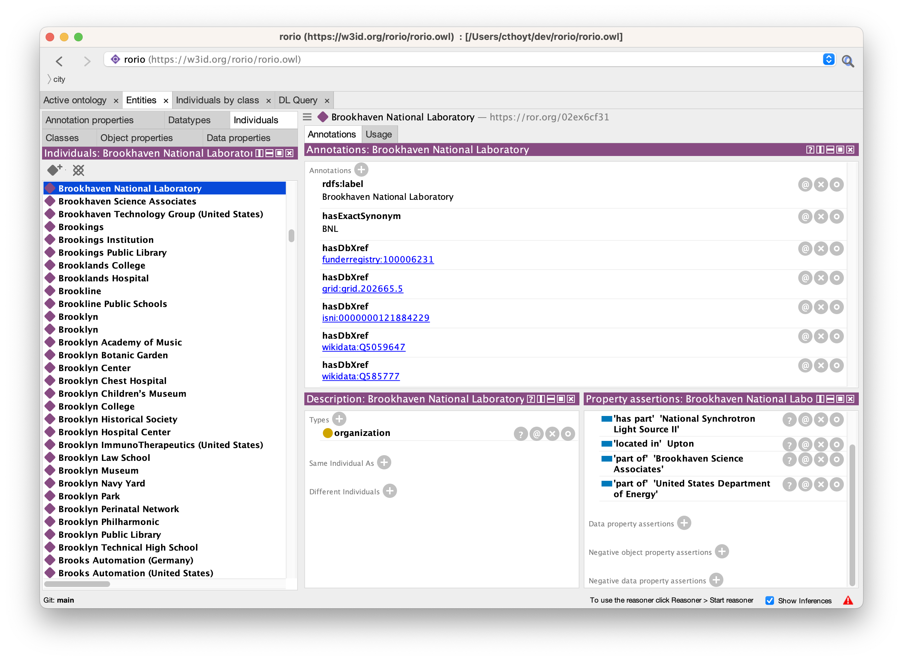

# ROR in OWL

Similar to the [ORCIDIO](https://github.com/cthoyt/orcidio), which makes an ontology of instances of researchers via
ORCID, this repository houses a script to convert the [Research Organization Registry (ROR)](https://ror.org) into
an ontology of instances of organizations.

The latest version can be downloaded with the following:

| Format         | PURL                              |
|----------------|-----------------------------------|
| OWL RDF/XML    | https://w3id.org/rorio/rorio.owl  |
| OBO Flat File  | https://w3id.org/rorio/rorio.obo  |
| OBO Graph JSON | https://w3id.org/rorio/rorio.json |




In the screenshot, you can see the `part of`, `has part`, and `located in` relations for the example organization. Unfortunately, Protégé does not have support for navigating partonomies on individuals.

## Build

Install the requirements and run with:

```shell
python -m pip install -r requirements.txt
python build.py
```

## Named Entity Recognition

A [Gilda](https://github.com/gyorilab/gilda) index is generated for usage in named entity recognition (NER)
and named entity normalization (NEN; i.e., grounding). It is available at https://w3id.org/rorio/rorio.gilda.tsv.gz.
It can be used like in:

```python
from urllib.request import urlretrieve
from gilda import Grounder

url = "https://w3id.org/rorio/rorio.gilda.tsv.gz"
path = "rorio.gilda.tsv.gz"
urlretrieve(url, path)

grounder = Grounder(path)
scored_matches = grounder.ground("Rheinische Friedrich-Wilhelms-Universität Bonn")
```

## License

The data downloaded from https://doi.org/10.5281/zenodo.6347574 are licensed under CC0. So is this repo. This is
additionally self-documented in the ontology files.
