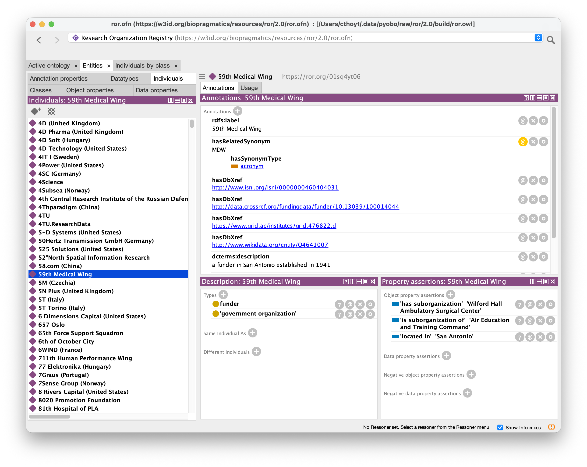

# ROR in OWL

> [!WARNING]
> This repository originally contained code for converting the
> [Research Organization Registry (ROR)](https://ror.org) into an ontology of
> instances. The code has now been upstreamed in the following two places:
>
> 1. The code for automatically interacting with Zenodo to download the latest
>    (or an explicitly requested) version of ROR is now in
>    https://github.com/cthoyt/ror-downloader
> 2. The code for constructing an ontology from ROR is now part of PyOBO, which
>    is a bigger suite for database to ontology conversions. See
>    https://github.com/biopragmatics/pyobo/blob/main/src/pyobo/sources/ror.py.
>
> The OBO DB Ingest project at https://github.com/biopragmatics/obo-db-ingest
> now stores the results of many database to ontology conversions. The ROR
> resources are listed under
> https://github.com/biopragmatics/obo-db-ingest/tree/main/export/ror#readme.
>
> Eventually, I would like to forward the old _rorio_ PURLs to point to the
> associated _obo-db-ingest_ PURLs as described in the table below.

| Format         | Legacy PURL                          | New PURL                                                 |
|----------------|--------------------------------------|----------------------------------------------------------|
| OWL Functional | https://w3id.org/rorio/rorio.ofn.gz  |                                                          |
| OWL RDF/XML    | https://w3id.org/rorio/rorio.owl.gz  | https://w3id.org/biopragmatics/resources/ror/ror.owl.gz  |
| OBO Flat File  | https://w3id.org/rorio/rorio.obo.gz  | https://w3id.org/biopragmatics/resources/ror/ror.obo     |
| OBO Graph JSON | https://w3id.org/rorio/rorio.json.gz | https://w3id.org/biopragmatics/resources/ror/ror.json.gz |



In the screenshot, you can see the `has suborganization`,
`is suborganization of`, and `located in` relations for the example
organization.

## Build

The build script is now a thin wrapper around PyOBO code. It can be run with
`uv`:

```shell
uv run build.py
```

## License

The data downloaded from https://doi.org/10.5281/zenodo.6347574 are licensed
under CC0. So is this repo. This is additionally self-documented in the ontology
files.
